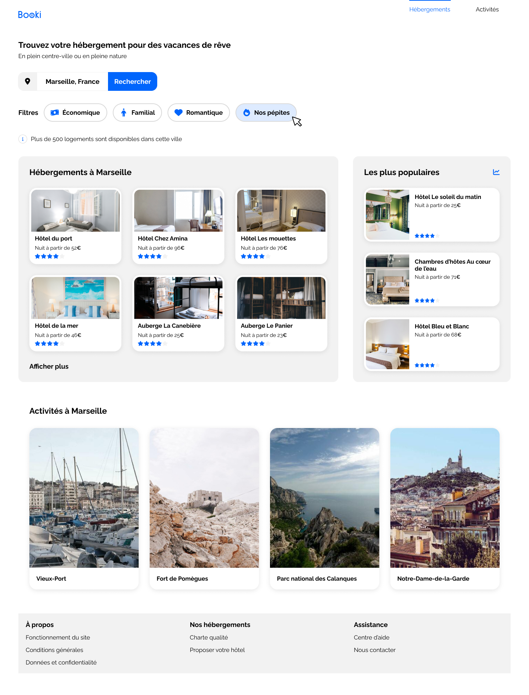

<a name="readme-top"></a>
<!-- PROJECT LOGO -->
<br />
<div align="center">
  <a href="https://github.com/gregmelo/Booki_OCR">
    
  </a>

<!-- TABLE OF CONTENTS -->
<details>
  <summary>Table des matières</summary>
  <ol>
    <li><a href="#a-propos-du-projet">À propos du projet</a></li>
    <li><a href="#langagesutilises">langages Utilisés</a></li>
    <li><a href="#missions">Missions</a></li>
    <li><a href="#liens">Liens</a></li>
    <li><a href="#installation">Installation</a></li>
    <li><a href="#contact">Contact</a></li>
  </ol>
</details>

<!-- ABOUT THE PROJECT -->
## À propos du projet

Boooki est le projet 2 de ma formation JavaScript / React OpenClassroom, mais également le projet 3 de ma formation PHP / symfony.
L’entreprise souhaite développer un site Internet qui permette aux usagers de trouver des hébergements et des activités dans la ville de leur choix.

La mission était de développer  l'interface du site avec du code HTML et CSS, en desktop first.




## Langages utilisés et autres technologies


## Missions

* Desktop First
* Responsive design

## Liens

Liens figma vers la maquette pour la formation CDA PHP / Symfony : https://www.figma.com/design/aQalcogjTTA0hCWuz72OaY/Maquettes-Booki-sans-responsive?node-id=3-0&p=f&t=mijvOMxMnAaA15BW-0

Liens figma vers la maquette pour la formation CDA JavaScript / React : https://www.figma.com/design/B3eLowtWREc9YXzBcGRAHn/Maquettes-Booki?node-id=3-0&p=f&t=K2MY3RmCeBSlwQZC-0

Liens figma vers le découpage de la maquette: https://www.figma.com/file/V1ZbylHUqhjLCRfQ51a828/Maquettes-Booki-(Copy)?type=design&node-id=191795%3A917&mode=design&t=xmRJjX4cQet3GYdN-1

Lien vers la présentation du projet : https://prezi.com/view/64nlSH8qGtlmQHa0ka4P/


## Installation

1. Clonez le repository de l'application
   ```sh
   git clone https://github.com/gregmelo/Booki_OCR.git
   ```

2. Lancez l'application avec Live Server !
  

## Contact

Véricel Grégory. - [GitHub](https://github.com/gregmelo/)


<!-- MARKDOWN LINKS & IMAGES -->

[html.com]: https://img.shields.io/badge/-HTML-f06529?style=flat&logo=html5&logoColor=fff
[html-url]: https://html.com/
[css.com]: https://img.shields.io/badge/-CSS-264de4?style=flat&logo=css3&logoColor=fff
[css-url]: https://www.w3.org/Style/CSS/